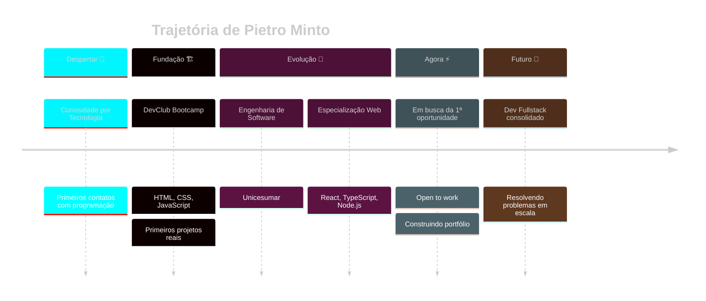

<!-- =============================================== -->
<!--   HEADER HOLOGRÁFICO COM EFEITO MATRIX/NEON     -->
<!-- =============================================== -->

<div align="center">
  


</div>

<div align="center">
  
</div>

<!-- =============================================== -->
<!--   BANNER ESTILO TERMINAL HACKER                 -->
<!-- =============================================== -->

```ansi
[38;5;51m╔══════════════════════════════════════════════════════════════════════════════╗[0m
[38;5;51m║[0m  [38;5;226m█▀█ █ █▀▀ ▀█▀ █▀█ █▀█   █▀▄▀█ █ █▄ █ ▀█▀ █▀█[0m                              [38;5;51m║[0m
[38;5;51m║[0m  [38;5;226m█▀▀ █ ██▄  █  █▀▄ █▄█   █ ▀ █ █ █ ▀█  █  █▄█[0m                              [38;5;51m║[0m
[38;5;51m║[0m                                                                              [38;5;51m║[0m
[38;5;51m║[0m  [38;5;46m> status     :[0m [38;5;82mONLINE[0m  [38;5;82m●[0m                                                  [38;5;51m║[0m
[38;5;51m║[0m  [38;5;46m> role       :[0m [38;5;255mFullstack Developer in Training[0m                              [38;5;51m║[0m
[38;5;51m║[0m  [38;5;46m> location   :[0m [38;5;255mBrazil 🇧🇷[0m                                                  [38;5;51m║[0m
[38;5;51m║[0m  [38;5;46m> mission    :[0m [38;5;255mBuilding solutions that matter[0m                               [38;5;51m║[0m
[38;5;51m╚══════════════════════════════════════════════════════════════════════════════╝[0m
```

<!-- =============================================== -->
<!--   ESTATÍSTICAS DE PERFIL EM TEMPO REAL          -->
<!-- =============================================== -->

<div align="center">
  
  
  
  

</div>

---

<!-- =============================================== -->
<!--   SOBRE MIM - ESTILO DOSSIÊ SECRETO             -->
<!-- =============================================== -->

<h2 align="center">
   
  CLASSIFIED FILE: PIETRO_MINTO.dat
</h2>

<table>
<tr>
<td width="55%">

```js
const developer = {
  🆔: "Pietro Fulan Minto",
  🎂: 18,
  📍: "Brazil",
  🎓: {
    universidade: "Unicesumar",
    curso: "Engenharia de Software",
    bootcamp: "DevClub"
  },
  💼: {
    status: "Open to work 🟢",
    procurando: "Estágio | Júnior",
    modalidade: ["Remoto", "Híbrido", "Presencial"]
  },
  💡: {
    paixao: "Resolver problemas reais com código",
    superpoder: "Aprender rápido e sob pressão",
    fraqueza: "Café > Sono"
  },
  🧠: {
    aprendendo: ["React", "TypeScript", "Node.js"],
    proximaMissao: "Dominar arquitetura fullstack"
  }
};

console.log(`> Connecting with ${developer.🆔}...`);
// > Status: Ready to build something amazing 🚀
```

</td>
<td width="45%" align="center">


<br><br>

```diff
+ 🎯 Foco: Web Development
+ 🚀 Vibe: Build. Break. Learn.
! ⚡ Mood: Always coding
- 😴 Status: Sleep is overrated
```

</td>
</tr>
</table>

---

<!-- =============================================== -->
<!--   ARSENAL DE TECNOLOGIAS (com hover effect)     -->
<!-- =============================================== -->

<h2 align="center">⚔️ ARSENAL TECNOLÓGICO</h2>

<div align="center">

<table>
<tr>
<td align="center" width="96">

<br>JavaScript
</td>
<td align="center" width="96">

<br>TypeScript
</td>
<td align="center" width="96">

<br>React
</td>
<td align="center" width="96">

<br>Node.js
</td>
<td align="center" width="96">

<br>HTML5
</td>
<td align="center" width="96">

<br>CSS3
</td>
<td align="center" width="96">

<br>Tailwind
</td>
</tr>
<tr>
<td align="center" width="96">

<br>Express
</td>
<td align="center" width="96">

<br>Vite
</td>
<td align="center" width="96">

<br>GitHub
</td>
<td align="center" width="96">

<br>Git
</td>
<td align="center" width="96">

<br>VSCode
</td>
<td align="center" width="96">

<br>Vercel
</td>
<td align="center" width="96">

<br>Netlify
</td>
</tr>
</table>

</div>

---

<!-- =============================================== -->
<!--   JORNADA DO DEV - TIMELINE                     -->
<!-- =============================================== -->

<h2 align="center">🗺️ MINHA JORNADA</h2>



---

<!-- =============================================== -->
<!--   PROJETOS - ESTILO MISSION CARDS               -->
<!-- =============================================== -->

<h2 align="center">🎯 MISSÕES CONCLUÍDAS</h2>

<div align="center">

<a href="https://github.com/Pietro-F-Dev/DevMovies">
  
</a>
<a href="https://github.com/Pietro-F-Dev/Projeto-Hamburger">
  
</a>

<a href="https://github.com/Pietro-F-Dev/Conversor-de-moedas-DevClub">
  
</a>
<a href="https://github.com/Pietro-F-Dev/Projeto-Random-numbers">
  
</a>

</div>

<p align="center">
  <a href="https://portfolio-pietrofdev.vercel.app">
    
  </a>
</p>

---

<!-- =============================================== -->
<!--   GITHUB ANALYTICS - PAINEL DE CONTROLE         -->
<!-- =============================================== -->

<h2 align="center">📡 PAINEL DE CONTROLE</h2>

<div align="center">
  
  
  

</div>

<div align="center">
  
  

</div>

<div align="center">
  
  

</div>

---

<!-- =============================================== -->
<!--   COBRINHA ANIMADA COMENDO CONTRIBUIÇÕES        -->
<!-- =============================================== -->

<h2 align="center">🐍 CONTRIBUTION SNAKE</h2>

<div align="center">
  
</div>

---

<!-- =============================================== -->
<!--   TROFÉUS                                       -->
<!-- =============================================== -->

<h2 align="center">🏆 CONQUISTAS DESBLOQUEADAS</h2>

<div align="center">
  
</div>

---

<!-- =============================================== -->
<!--   CONTATO - ESTILO TERMINAL                     -->
<!-- =============================================== -->

<h2 align="center">📡 ESTABELECER CONEXÃO</h2>

```bash
$ pietro --connect
> Iniciando handshake...
> Aguardando você do outro lado da conexão... 🔗
```

<p align="center">
  <a href="https://portfolio-pietrofdev.vercel.app" target="_blank">
    
  </a>
  <a href="https://www.linkedin.com/in/pietro-minto/" target="_blank">
    
  </a>
  <a href="mailto:pietrofulanminto@gmail.com">
    
  </a>
  <a href="https://www.instagram.com/pietro_f_minto/" target="_blank">
    
  </a>
</p>

---

<!-- =============================================== -->
<!--   FRASE FINAL ASSINATURA                        -->
<!-- =============================================== -->

<div align="center">

```diff
@@ "Código limpo não é escrito seguindo regras. É escrito por quem se importa." @@
+ - Robert C. Martin
```

</div>

<div align="center">
  
</div>

<div align="center">
  
  ### ⭐ Se você chegou até aqui, considera deixar uma estrela em algum projeto! ⭐
  
  

</div>
